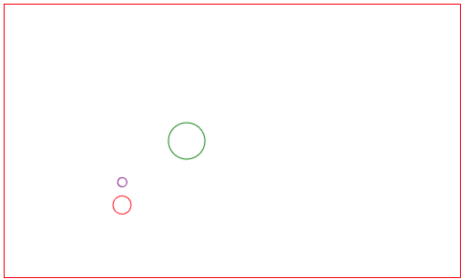

### 任务
* 使支持 Group 分组
* 增加图形 Circle

### 原理解析
##### Group.ts
定义Group
```js
export class Group extends Container<Group | Shape> {
    
}
```
### BaseLayer.ts
设置 BaseLayer 中允许添加 Group 子项
```js
export abstract class BaseLayer extends Container<Group | Shape> {
}
```
### 测试代码
参考index.ts
### 效果
